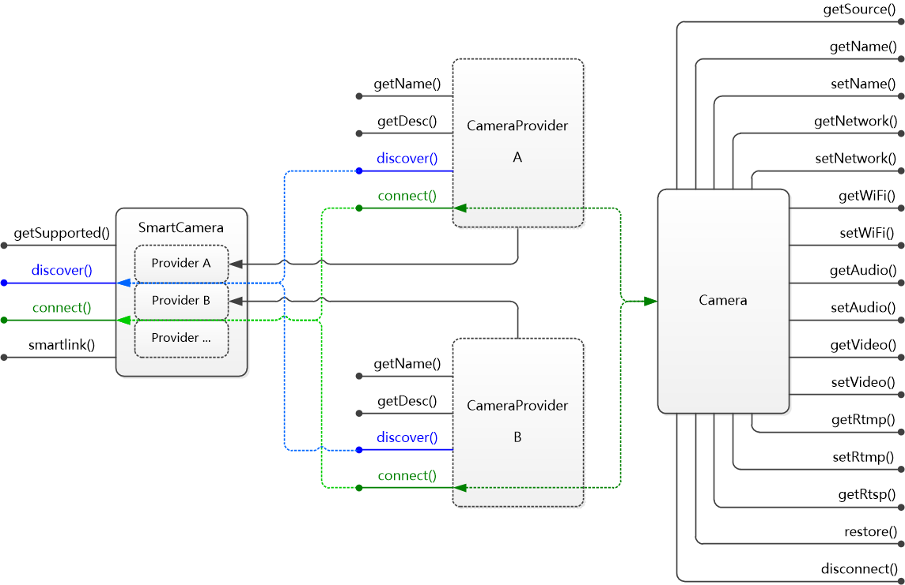

# SmartCamera_linux
适用于 Linux 平台的智能摄像头 SDK，支持 SmartLink 智能配网、局域网发现，和摄像头的网络配置、音视频参数设置，以及 RTMP 推流设置等。

SmartCamera 旨在提供简单易用的 SDK，兼容包括互联网摄像头、监控摄像头等各种摄像头设备，实现对摄像头管理和配置的智能化和移动化。

## 认识 SmartCamera
- SDK 主体结构：

- SmartCamera，SmartCamera 是一个单例实例，是使用 SDK 的总入口
- CameraProvider，CameraProvider 是一个接口，针对不同厂商的摄像头，提供不同的 CameraProvider 实现
- Camera，Camera 同样是一个接口，针对不同厂商提供对应的实现

## 使用 SmartCamera
- 下载 include 和 lib 文件夹，并导入到工程。
- 范例代码：
```c++
SmartCamera*	g = SmartCamera_getInstance();
ArrayList<CameraProvider*>*	providers = g->getSupported();
		
g->discover(providers, this, 5);

providers->destroy();


virtual void cameraDiscoverAbort(CameraProviderSource* source)
{
    std::cout << "ABORT: " << source->getName() << "\n";
}

virtual void cameraDiscoverTimeout(CameraProviderSource* source)
{
    std::cout << "TIMEOUT: " << source->getName() << "\n";
}

virtual void cameraDiscovered(CameraSource* source)
{
    std::cout << "FOUND: " << source->getUrl() << "\n";
    
    SmartCamera*	g = SmartCamera_getInstance();
    Camera*		camera = g->connect(source->getUrl());
    
    if(camera)
    {
        const NETWORK_CONFIG*	network = camera->getNetwork();

        if(network)
            std::cout << "DHCP: " << (network->dhcp ? "YES" : "NO") << ", "
                    << "IP: " << network->ip << ", "
                    << "MASK: " << network->mask << ", "
                    << "GATEWAY: " << network->gateway << ", "
                    << "DNS1: " << network->dns1 << ", "
                    << "DNS2: " << network->dns2 << "\n";

        ....
    }
}
```


## 反馈及意见
当你遇到任何问题时，可以通过在 GitHub 的 repo 提交 issues 来反馈问题，请尽可能的描述清楚遇到的问题，如果有错误信息也一同附带，并且在 Labels 中指明类型为 bug 或者其他。
[通过这里查看已有的 issues 和提交 Bug](https://github.com/azhisoft/SmartCamera_linux/issues)
